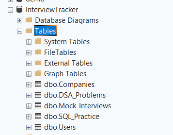
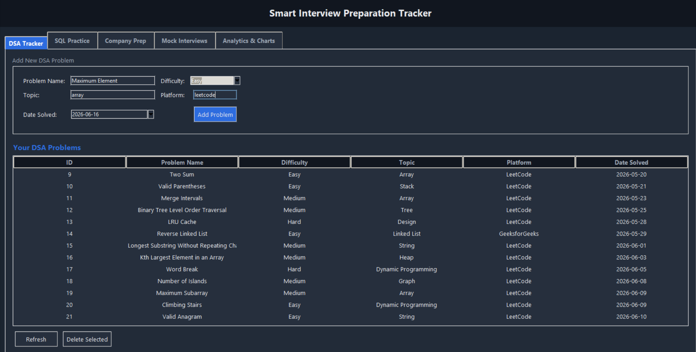
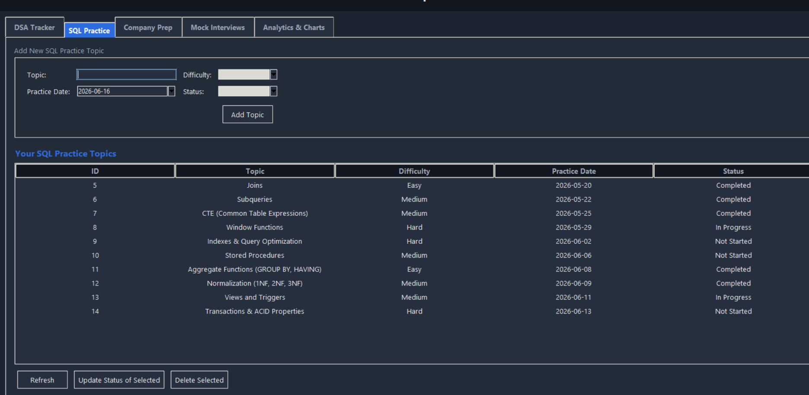
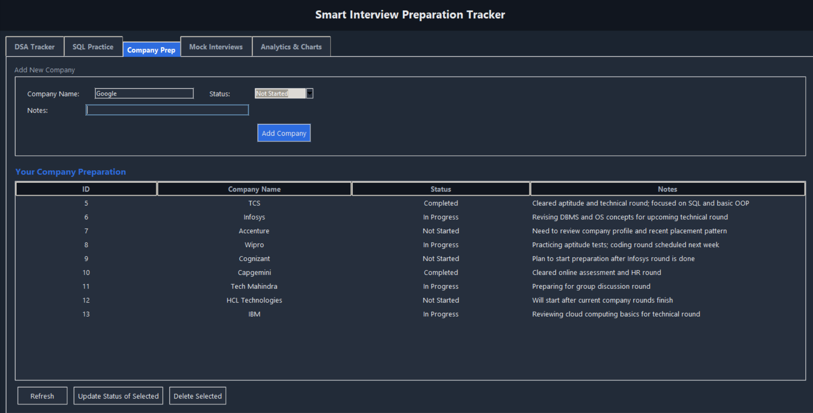
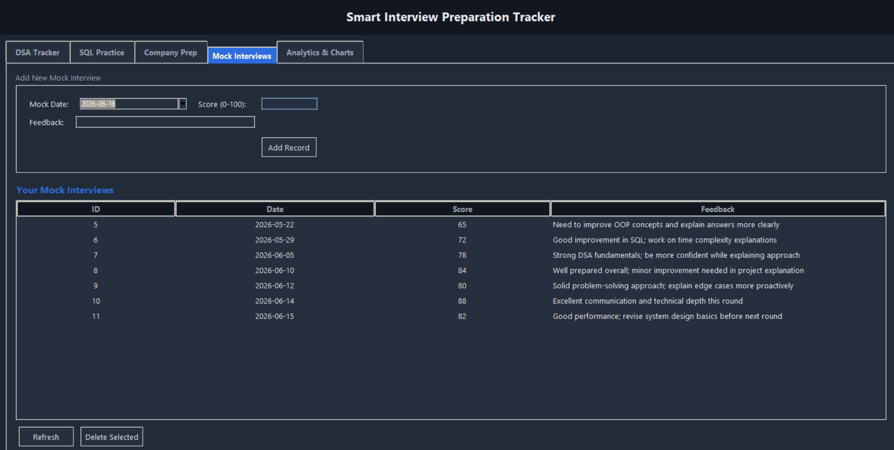
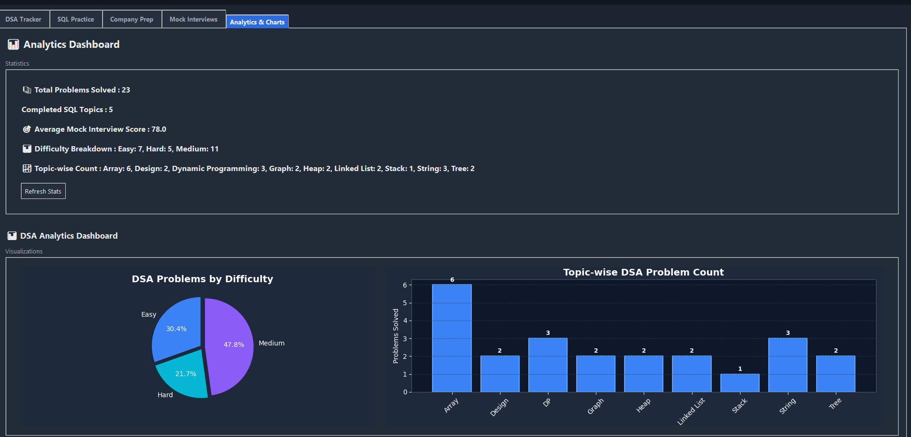
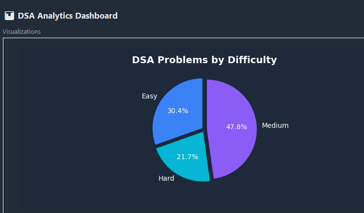
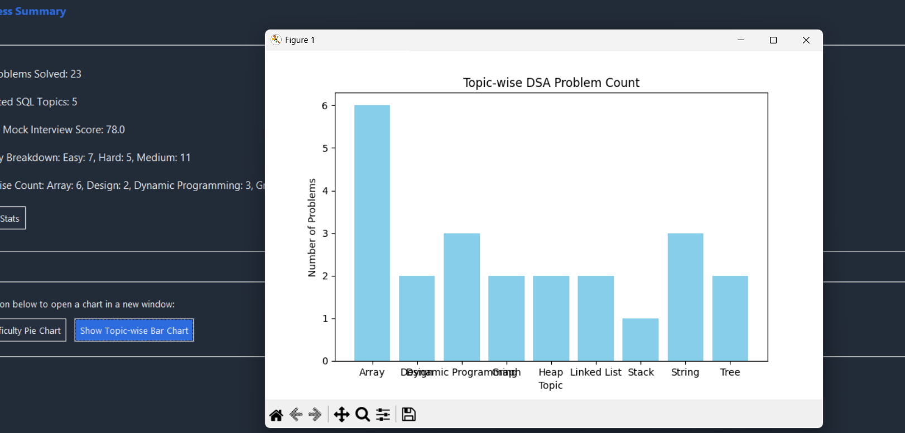

# Smart Interview Preparation Tracker

A desktop application to help students track their placement preparation — DSA practice, SQL topics, company-wise preparation, and mock interview performance — all in one place, with analytics and visual charts.

## Problem Statement

Students preparing for placements usually track their progress across multiple platforms, notebooks, and spreadsheets — DSA problems on LeetCode, SQL practice notes, company research, and mock interview feedback, all scattered. This project provides a single local application to record and visualize all of this in one place.

## Tech Stack

| Layer | Technology |
|---|---|
| Language | Python |
| GUI | Tkinter (ttk) |
| Database | Microsoft SQL Server (SQLEXPRESS) |
| DB Connectivity | PyODBC |
| Visualization | Matplotlib |
| Version Control | Git & GitHub |

This is a standalone desktop application — no web server, no internet connection required. It runs entirely on the local machine using a local SQL Server instance.

## Features

- **DSA Tracker** — add, view, and delete solved DSA problems (name, difficulty, topic, platform, date)
- **SQL Practice Tracker** — add, view, update status, and delete SQL practice topics
- **Company Preparation** — add, view, update status, and delete company prep records with notes
- **Mock Interview Tracker** — add, view, and delete mock interview scores and feedback
- **Analytics Dashboard** — total problems solved, completed SQL topics, average mock score, difficulty breakdown, topic-wise problem count
- **Charts** — pie chart of DSA problems by difficulty, bar chart of topic-wise problem count

For detailed architecture and design decisions, see `docs/project_notes.md`.

## Database Design

One user can have many records across four related tables:

```
Users
 |
 |---- DSA_Problems
 |---- SQL_Practice
 |---- Companies
 |---- Mock_Interviews
```

All child tables reference `Users` via a foreign key (`user_id`).

## Project Structure

```
Interview_Preparation_Tracker/
├── database/
│   ├── create_tables.sql
│   ├── sample_data.sql
│   └── analytics_queries.sql
├── docs/
│   └── project_notes.md
├── reports/
├── screenshots/
├── src/
│   ├── db_connection.py
│   ├── user.py
│   ├── dsa.py
│   ├── sql_tracker.py
│   ├── company.py
│   ├── mock_interview.py
│   ├── analytics.py
│   ├── charts.py
│   └── main.py
└── README.md
```

## Setup & How to Run

### Prerequisites

- Python 3.x
- Microsoft SQL Server (SQLEXPRESS) with SQL Server Management Studio
- ODBC Driver 17 for SQL Server

### Steps

1. **Set up the database**

   Open SQL Server Management Studio, connect to `localhost\SQLEXPRESS`, and run the scripts in order:
   - `database/create_tables.sql` — creates the `InterviewTracker` database and tables
   - `database/sample_data.sql` — inserts sample data

2. **Install Python dependencies**

   ```
   pip install pyodbc matplotlib tkcalendar
   ```

3. **Run the application**

   ```
   cd src
   python main.py
   ```

The application connects to `localhost\SQLEXPRESS` using Windows Authentication — no username/password needed.

## Modules

| Module | File | Description |
|---|---|---|
| User Management | `user.py` | Add and view users |
| DSA Tracker | `dsa.py` | CRUD for DSA problems |
| SQL Practice Tracker | `sql_tracker.py` | CRUD for SQL practice topics |
| Company Preparation | `company.py` | CRUD for company prep records |
| Mock Interview Tracker | `mock_interview.py` | CRUD for mock interview records |
| Analytics | `analytics.py` | Aggregated statistics (counts, averages, distributions) |
| Charts | `charts.py` | Matplotlib visualizations |
| GUI | `main.py` | Tkinter interface tying all modules together |

## Screenshots
## Screenshots

### Database Schema



### DSA Tracker



### SQL Practice Tracker



### Company Preparation Tracker



### Mock Interview Tracker



### Analytics Dashboard



### Difficulty Distribution Pie Chart



### Topic-wise Problem Count



## Future Enhancements

- Daily streak tracking
- Goal tracking (e.g., target number of problems)
- Placement readiness score across all categories
- Export progress reports as PDF
- Multi-user login support

## Author

**Kanishka Joshi**  
5th Semester CSE (Data Science)  
Swami Keshvanand Institute of Technology (SKIT)
